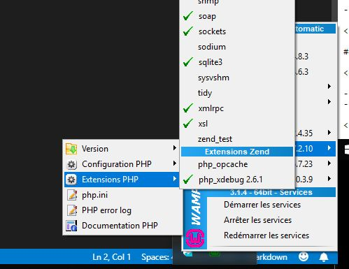

# WampServer

1. Installer Wampserver : http://www.wampserver.com/
- Arrêter les services ou couper le server
2. PHP/Extensions PHP : activer php_xdebug

3. PHP/php.ini : 
- Recherche "; XDEBUG Extension" et modifier comme suit
- nota : mettre le bon chemin à `zend_extension=`

```txt
; XDEBUG Extension
[xdebug]
zend_extension="c:/wamp64/bin/php/php7.2.10/zend_ext/php_xdebug-2.6.1-7.2-vc15-x86_64.dll"
xdebug.default_enable=1
xdebug.remote_host=localhost
xdebug.remote_port = 9000
xdebug.remote_enable = On
xdebug.remote_autostart = On
xdebug.profiler_enable = off
xdebug.profiler_enable_trigger = On
xdebug.profiler_output_name = cachegrind.out.%t.%p
xdebug.profiler_output_dir ="c:/wamp64/tmp"
xdebug.show_local_vars=0
```
- Rechercher "[opcache]" et invalider en mettant `;` l'option

```txt
;opcache.enable=1
```
- enregistrer
- Redémarrer le server
4. PHP/Extensions PHP, vous devez voir pour xdebug :


# Visual Studio Code
1. Installer les 3 extensions suivantes
    - celles de Felix Becker

;

2. Aller dans File > Preferences > Settings > Extensions > PHP
- edit in settings.json


- dans la partie droite, ajouter les 3 lignes PHP
    - veiller à mettre le bon chemin pour `php.exe`
```txt
"php.validate.enable": true,
"php.validate.executablePath": "C:\\wamp64\\bin\\php\\php7.2.10\\php.exe",
"php.validate.run": "onType",
```
- enregistrer

# Visual Studio Code : place au debug !
1. Ouvrir votre projet PHP
2. Ouvrir votre projet dans le localhost (important ! ... j'ai trop longtemps oublié de le faire !!!)
3. lancer le debug
    1. Mode Debug
    2. Sélectionner `listen for Xdebug` (ou PHP en cliquant sur "l'engrenage")
    -   mettre un point d'arrêt dans le code (cliquer à gauche d'un numéro de ligne)
    3. Lancer le débug


4. refresh de la page localhost

Utiliser les contrôles pour avancer en ligne à ligne et autres


